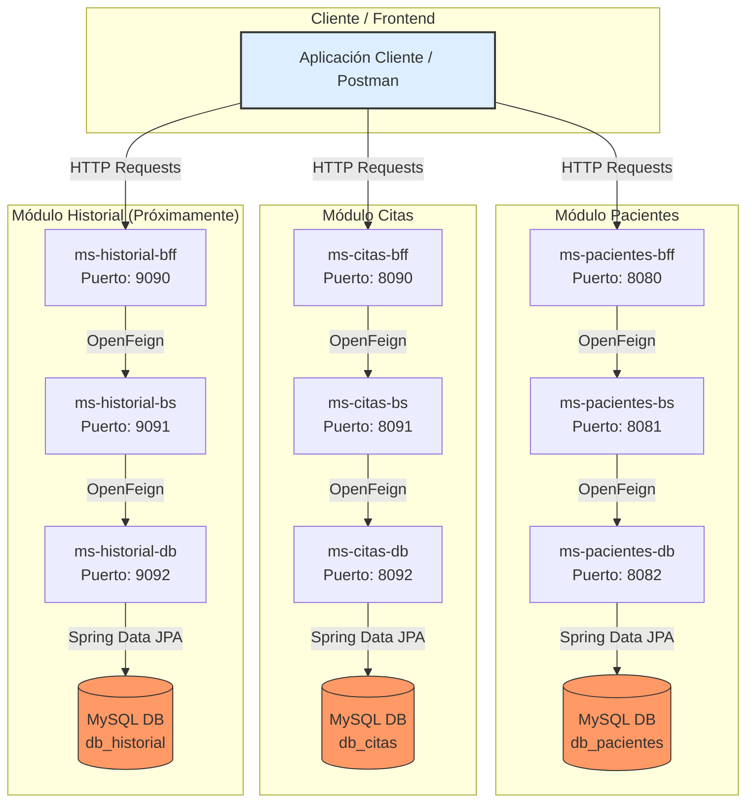

# App Médica - Prueba Parcial 2
## Desarrollo Fullstack 1

Este proyecto consiste en un sistema de gestión médica basado en una arquitectura distribuida de microservicios. La solución está dividida en capas bajo el patrón **BFF (Backend For Frontend)**, **BS (Business Service)** y **DB (Data Service)**, garantizando el desacoplamiento de responsabilidades y la escalabilidad del sistema. Cada módulo cuenta con su propia persistencia independiente (Database per Service).

---

## ⚙️ Matriz de Servicios y Puertos

| Módulo | Microservicio | Tipo/Capa | Puerto | Repositorio GitHub |
| :--- | :--- | :--- | :---: | :--- |
| **Pacientes** | `ms-pacientes-bff` | BFF (Orquestador) | `8080` | [Ver Repositorio](https://github.com/rfelipe715/ms-app-medica-pacientes-bff.git) |
| | `ms-pacientes-bs` | BS (Negocio) | `8081` | [Ver Repositorio](https://github.com/rfelipe715/ms-app-medica-pacientes-bs.git) |
| | `ms-pacientes-db` | DB (Datos) | `8082` | [Ver Repositorio](https://github.com/rfelipe715/ms-app-medica-pacientes-db.git) |
| **Citas** | `ms-citas-bff` | BFF (Orquestador) | `8090` | [Ver Repositorio](https://github.com/rfelipe715/ms-app-medica-citas-bff.git) |
| | `ms-citas-bs` | BS (Negocio) | `8091` | [Ver Repositorio](https://github.com/rfelipe715/ms-app-medica-citas-bs.git) |
| | `ms-citas-db` | DB (Datos) | `8092` | [Ver Repositorio](https://github.com/rfelipe715/ms-app-medica-citas-db.git) |
| **Historial** | `ms-historial-bff` | BFF (Orquestador) | `9090` | *Pendiente de creación* |
| *(Nuevo)* | `ms-historial-bs` | BS (Negocio) | `9091` | *Pendiente de creación* |
| | `ms-historial-db` | DB (Datos) | `9092` | *Pendiente de creación* |

---

## 🛠️ Stack Tecnológico

* **Java:** 17
* **Framework Principal:** Spring Boot 4.0.6
* **Comunicación Inter-servicio:** Spring Cloud OpenFeign (Solo en capas `bff` y `bs`)
* **Persistencia:** Spring Data JPA
* **Base de Datos:** MySQL (Gestión mediante `mysql-connector-j`)
* **Productividad:** Project Lombok

---

## 🧱 Responsabilidad de las Capas

> 💡 **Nota de Diseño:** Todos los proyectos comparten una estructura limpia y estandarizada utilizando inyección de dependencias y controladores REST.

### 1. Capa BFF (Backend For Frontend)
* Actúa como la puerta de entrada para las aplicaciones cliente.
* Encargada de recibir peticiones HTTP, validaciones primarias de contratos (`spring-boot-starter-validation`) y orquestación.
* Utiliza **OpenFeign** para comunicarse directamente con su respectiva capa de negocio (`bs`).

### 2. Capa BS (Business Service)
* Contiene toda la lógica de negocio y las reglas específicas del dominio médico.
* Transforma datos si es necesario y expone endpoints internos.
* Utiliza **OpenFeign** para solicitar la persistencia o recuperación de información a la capa `db`.

### 3. Capa DB (Data Service)
* **Es la única capa con acceso directo a la base de datos MySQL.**
* No implementa `Spring Cloud OpenFeign` ni hereda dependencias de mensajería cloud.
* Utiliza repositorios de JPA para interactuar con el motor relacional. Cada módulo (`-db`) apunta a un esquema de base de datos totalmente aislado para cumplir con el principio de microservicios.

---

## 🚀 Instrucciones de Levantamiento

Para ejecutar los microservicios de manera local, se recomienda seguir el orden ascendente (desde la persistencia al cliente) para asegurar la disponibilidad de los servicios dependientes:

1. **Base de Datos:** Asegúrate de tener instancias de MySQL corriendo con los esquemas correspondientes para cada módulo.
2. **Capas DB:** Levantar primero los proyectos `-db` (Puertos `8082`, `8092`, `9092`).
3. **Capas BS:** Levantar los proyectos `-bs` (Puertos `8081`, `8091`, `9091`).
4. **Capas BFF:** Por último, iniciar los componentes `-bff` (Puertos `8080`, `8090`, `9090`).
